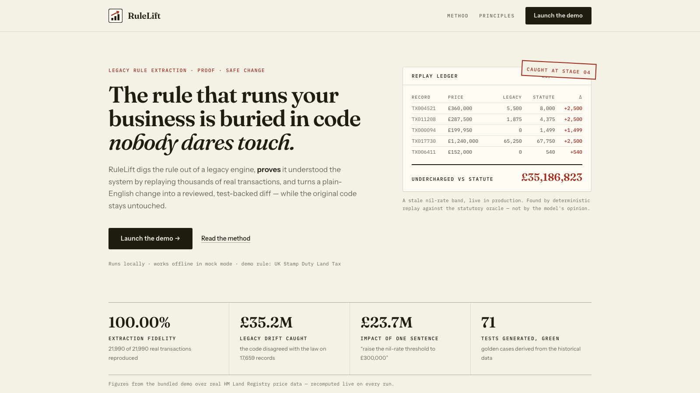
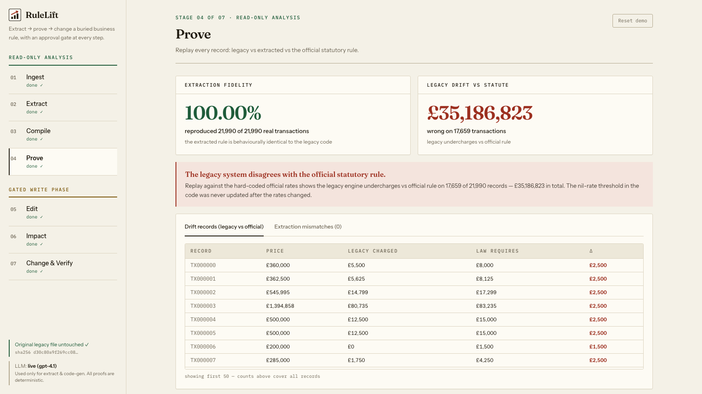
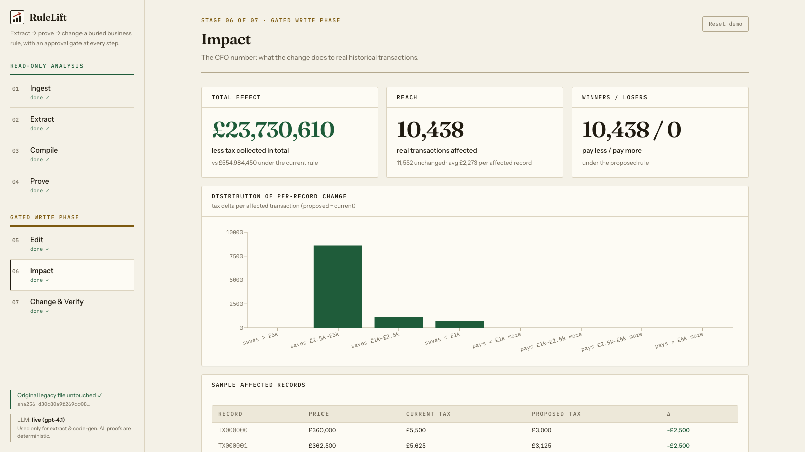

<div align="center">


# RuleLift

**The rule that runs your business is buried in code nobody dares touch.<br/>RuleLift digs it out — and proves it.**

[](https://www.python.org/)
[](https://fastapi.tiangolo.com/)
[](https://react.dev/)
[](backend/tests/test_core.py)
[](#llm-modes)
[](LICENSE)

[Quick start](#quick-start) · [How it works](#how-it-works) · [The proof model](#the-proof-model) · [Guardrails](#guardrails-enforced-in-code-not-prose) · [90-second demo](#the-demo-in-90-seconds) · [FAQ](#faq)



</div>

---

## The problem

Every mature company runs on business rules — tax bands, pricing tiers, commission
schedules, eligibility thresholds — that live **only** as code in systems nobody fully
understands anymore. The person who wrote it left. The docs never existed. So every change
becomes a consulting engagement: weeks of code archaeology, and at the end you still can't
be sure the "recovered" rule is what production actually does.

LLMs can read that code in seconds — but an LLM's summary is an *opinion*. You can't bet a
tax filing on an opinion.

## The answer: extract, then **prove**

RuleLift uses the model for exactly one thing it's great at — *proposing* a structured
reading of messy code — and then submits that proposal to a judge that cannot hallucinate:
**deterministic replay over real historical data**.

<div align="center">

</div>

That screen is the product in one shot, running over **21,990 real HM Land Registry
transactions**:

- **100.00% extraction fidelity** — the extracted rule reproduces the legacy engine's
  behaviour on every single record. Not "the model says it understood" — *replayed and counted*.
- **£35,186,823 of legacy drift** — as a by-product, replaying against the hard-coded
  statutory rates catches the legacy engine mischarging 17,659 transactions. The demo
  engine ships with a deliberately stale nil-rate band (the classic "temporary relief ended,
  nobody updated the batch job" bug). Nobody tells RuleLift where the bug is. The replay finds it.

Then a non-engineer types *"raise the nil-rate threshold to £300,000"*, sees the exact
£ impact on real data, and gets a unified diff verified by a pytest suite generated from
that same data — all behind explicit human approval at every stage.

---

## Quick start

```bash
git clone https://github.com/sambitsargam/rulelift.git
cd rulelift
make demo          # builds everything, serves http://localhost:8877
```

Requirements: **Python 3.11+**, **Node 18+**, `make`. No database, no auth, no manual data
setup — on first run the app downloads HM Land Registry Price Paid Data (public CSV) and
falls back to a realistic synthetic dataset if offline.

```bash
make test          # 38 unit tests for the deterministic core — no LLM, no network
make headless      # the whole math pipeline in your terminal: fidelity, drift, impact, diff, pytest
make dev           # backend + Vite dev server with hot reload
```

### LLM modes

| mode | when | what happens |
|---|---|---|
| **live** | `OPENAI_API_KEY` set (in `.env` or env) | Stage 2 extraction and stage 7 code-gen call the model (`RULELIFT_MODEL`, default `gpt-4.1`) with strict-JSON output, schema validation, and a max-3 retry loop |
| **mock** | no key | extraction uses the bundled cached spec; code-gen uses the deterministic generator — the **full demo works with zero network** |

The LLM is used for stages 2 and 7 only. Everything else — compile, replay, impact math,
test generation, pass/fail — is plain deterministic Python, always.

---

## How it works

| # | stage | phase | what happens |
|---|---|---|---|
| 01 | **Ingest** | 🟢 read-only | Load the legacy engine (read-only) + 20k+ real transactions; classify every messy row with a reason — junk never crashes the pipeline |
| 02 | **Extract** | 🟢 read-only | The LLM proposes a strict-JSON rule spec: bands, conditions, plain-English summary, honest assumptions. Schema-validated; errors fed back; max 3 attempts |
| 03 | **Compile** | 🟢 read-only | The spec is deterministically compiled to `apply_extracted(price)`. No model at runtime |
| 04 | **Prove** | 🟢 read-only | Replay **every** record through legacy code, extracted rule, and statutory oracle. Fidelity % and drift £ are counted, not claimed |
| 05 | **Edit** | 🟠 gated write | Plain-English rule changes, parsed by a deterministic grammar (not the LLM), previewed as a band-table diff before approval |
| 06 | **Impact** | 🟠 gated write | Old rule vs new rule over all records: affected count, total £, winners/losers, distribution — the CFO number, computed live |
| 07 | **Change & Verify** | 🟠 gated write | Unified diff applied to a **guarded copy**; pytest golden cases generated from the historical data; green/red from the exit code, with one automated feedback retry |

Every stage waits for an explicit **Approve**. Reject halts and invalidates everything
downstream. Only the LLM extraction can be skipped (it falls back to the cached spec).

## The proof model

Stage 4 replays three implementations over every valid record:

| comparison | question it answers |
|---|---|
| legacy `vs` extracted | **Fidelity** — did the extraction understand the system? |
| legacy `vs` statutory oracle | **Drift** — where does the system disagree with the law, and for how much? |

The statutory rates live in [`backend/core/oracle.py`](backend/core/oracle.py), which the
legacy module never imports — the drift finding is a genuine cross-check, not circular.
Extraction mismatches are **flagged on screen, never hidden**: surfacing uncertainty is the
feature.

<div align="center">

</div>

## Guardrails (enforced in code, not prose)

| guarantee | enforcement |
|---|---|
| Nothing runs without approval | FastAPI stage machine rejects out-of-order or unapproved runs (HTTP 409) — [`backend/app.py`](backend/app.py) |
| The original legacy file is never modified | every write goes through a **write-guard** that raises on any path outside `workdir/` — [`backend/core/guard.py`](backend/core/guard.py) |
| …and you can see that, live | the legacy file is SHA-256 fingerprinted at startup; integrity is re-checked and displayed in the UI at all times |
| The model never grades itself | fidelity, drift, impact and test results come from deterministic replay and pytest exit codes only |
| No surprise commits | the pipeline never invokes git |
| Bad data can't take it down | every row is classified (blank / junk / non-positive / implausible outlier), counted, excluded from the math, and shown with examples |

## The demo, in 90 seconds

1. **Ingest** — "Here's a legacy tax engine: mainframe-ported Python, zero docs. A
   consultant would read this for weeks." Approve: 22,000 real UK transactions load and
   every messy row is triaged.
2. **Extract** — "The tool read the code. Here's the rule in plain English," side by side
   with the raw source — including the model's honest assumptions.
3. **Prove** — the hero moment: **100.00% fidelity** over 21,990 records, *and* the red
   panel — the legacy code disagrees with the statute book on **17,659 transactions,
   £35.2M**. Nobody told it where the bug was.
4. **Edit** — one sentence: *"raise the nil-rate threshold to £300,000."* Preview the parsed
   change before it applies.
5. **Impact** — **10,438 real transactions affected, £23.7M** — with the distribution and
   who wins.
6. **Change & Verify** — unified diff on a guarded copy, **71 generated golden tests, green**.
   "Weeks of consultant work in minutes — and nothing changed without my approval."

*Exact figures depend on the dataset snapshot; every number is recomputed live, never asserted.*

---

## Architecture

```
                       ┌─────────────────────────────────────────────┐
   legacy/             │  backend (FastAPI stage machine, approval   │      frontend
   sdlt_engine.py ───▶ │  gates, in-memory state)                    │ ◀──  React + Vite +
   (read-only,         │                                             │      Tailwind + Recharts
    SHA-256 watched)   │  core/ · deterministic: oracle, schema,     │
                       │    compiler, replay, impact, editor,        │
   data/ ────────────▶ │    testgen, changegen, ingest, write-guard  │
   22k real UK         │  llm/  · the ONLY code that talks to a      │
   transactions        │    model API (stages 2 & 7, strict JSON)    │
                       └──────────────────┬──────────────────────────┘
                                          ▼
                              workdir/  (the only writable path —
                              working copy + generated pytest suite)
```

```
legacy/sdlt_engine.py     the "black box" — crusty UK Stamp Duty engine (never modified)
backend/core/             deterministic core (all the math, all the judging)
backend/llm/              LLM proposal layer (extraction + code-gen only)
backend/tests/            38 unit tests for the core
frontend/                 single-page app
data/cached_spec.json     fallback spec → the demo runs with no API key
scripts/headless_demo.py  the entire pipeline in the terminal, no UI
```

## FAQ

**Why UK Stamp Duty as the demo?**
It's a real, public, band-based rule that changes at every Budget — everyone instantly
understands "the government moved the threshold." And it validates deterministically, so
the proof is airtight.

**Is the £35M bug real?**
The bug is planted (a stale nil-rate band — exactly what happens in production when a
temporary relief ends and nobody updates the batch job), but its *detection* is 100% real:
deterministic replay against the never-imported statutory oracle. The app has no idea where
the bug is.

**Do I need an API key?**
No. Without one, the demo runs end-to-end in mock mode (cached spec + deterministic
code-gen). With one, extraction and code-gen go live.

**Can it modify my legacy code?**
It physically can't: every write is routed through a guard that raises on any path outside
`workdir/`, and the original file's hash is verified on screen throughout.

**Is this limited to tax?**
The demo is one rule done bulletproof, but the pattern — *extract → compile → replay-prove
→ edit → impact → test-backed change* — applies to any rule you can replay against
historical inputs: pricing, commissions, eligibility, billing.

---

<div align="center">

**RuleLift** — legacy rule extraction, proof & safe change.<br/>
MIT licensed · built with FastAPI, React, and a healthy distrust of unverified model output.

</div>
